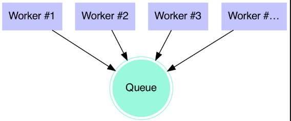

# Queue-Based Distribution

In some cases, the best response is to accept a job and promise to execute it later.
Implementing a distributed system using queues is a trade-off, improving throughput with the drawback of increased latency.

Looking at basic architecture, it's composed of two elements, steps as follow:

- a queue that stores jobs and workers that consume the jobs from a queue
- process them
- send the result to another destination



When an application makes such a promise, a job distribution mechanism is needed.
The upside is that if correctly implemented, it allows the application to scale its workload horizontally pretty easily.

## RQ

the [RQ Library](https://github.com/rq/rq) provides a simple and direct approach to implement a queue in Python program.
The letter _R_ and _Q_ are used to designate _Redis_ and _Queue_.

`Redis` is an open-source in-memory database project implementing a networked, in-memory key-value store with optional durability.

## RQ workers

By using RQ, an application can push jobs into a Redis database and have workers executing these jobs asynchronously.

!!! warning

    You can only run below code once redis server is already run.

```python title="rq-enqueue.py"
import time
from rq import Queue
from redis import Redis

q = Queue(connection=Redis())

job = q.enqueue(sum, [42, 43])
# Wait until the result is ready --
while job.result is None:
    time.sleep(1)

print(job.result)
```

## Celery

_Celery_ is another queue management system. In contrast to RQ, it is broker agnostic and can use various software as a broker, such as Redis, RabbitMQ or Amazon SQS.

## Celery backend

_Celery_ also needs a **backend** for storing the results of the job.
It supports a variety of solutions, such as Redis, MongoDB, SQL databases, ElasticSearch, files, etc.

Celery implements its own serialization format for its jobs. However, this format is not specific to Python.
That means it is possible to implement job creators or consumers in different languages.

## Celery task execution: Worker and queues

In Celery, tasks are functions that can be called asynchronously.
When called, Celery puts them in the broker queue for execution.
Remote workers then execute the tasks, putting the task results into the backend.

When called, a task returns a `celery.result.AsyncResult` object.

```python title="celery-task.py"
import celery

app = celery.Celery('celery-task',
                    broker='redis://localhost',
                    backend='redis://localhost')

@app.task
def add(x, y):
    return x + y

if __name__ == '__main__':
    result = add.delay(4, 4)
    print("Task state: %s" % result.state)
    print("Result: %s" % result.get())
    print("Task state: %s" % result.state)
```

Above example is a simple implementation of a Celery task.
The Celery application is created with the main module name as its first argument, and then the URL to access the broker and backends.

the `app.task` function decorator registers the add task so it can be used asynchronously in the application, leveraging Celery workers for execution.

If you run the code above, it will be PENDING, until the workers is ready.
To initiate the workers, run command

```bash
celery -A celery-task worker
```

Once the worker is ready, the result in earlier code will be shown.

## Celery: Chaining Tasks

_Celery_ supports chaining tasks, which allows you to build more complex workflows.


## `celery.chain`

```python title="celery-chain.py"
import celery

app = celery.Celery('celery-task',
                    broker='redis://localhost',
                    backend='redis://localhost')

@app.task
def add(x, y):
    return x + y

if __name__ == '__main__':
    result = add.delay(4, 4)
    print("Task state: %s" % result.state)
    print("Result: %s" % result.get())
    print("Task state: %s" % result.state)
```

to run code above, you need to start the worker first by running

```bash
celery -A celery-chain worker
```

Building a program with multiple idempotent functions that can be chained together is very natural in functional programming.
Again, this kind of design makes it very easy to parallelize job execution and therefore makes it possible to increase the throughput of your program and scale its execution horizontally.

## Celery: Multiple Queues

By default, _Celery_ uses a single queue named `celery`.
However, it is possible to use multiple queues to spread the distribution of the tasks.
This feature makes it possible to have finer control over the distribution of the jobs to execute.


### Low priority job

For example, it's common to have a queue dedicated to low-priority jobs, where only a few workers are available.
Notice the new _options_ in the worker command `--queues celery, low-priority`.

```python title="celery-task-queue.py"
import celery

app = celery.Celery('celery-task-queue',
                    broker='redis://localhost',
                    backend='redis://localhost')

@app.task
def add(x, y):
    return x + y

if __name__ == '__main__':
    result = add.apply_async(args=[4, 6], queue='low-priority')
    print("Task state: %s" % result.state)
    print("Result: %s" % result.get())
    print("Task state: %s" % result.state)
```

to start the workers with queue low-priority and tag `celery`

```bash
celery -A celery-task-queue worker --queues celery,low-priority
```

!!! tip

    You might be familiar with this backend concept as you're using [Airflow](https://airflow.apache.org/) as much as building the pipelines.
